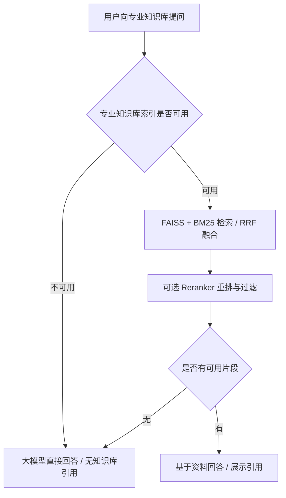

# Enterprise_RAG

基于 Flask 的多知识库 RAG 问答演示项目，支持员工培训、产品信息和专业知识问答。专业知识库新增 **Fallback 机制**：当索引未就绪或过滤后没有可用资料时，切换至大模型直接回答，并返回空引用列表。

公开仓库仅提供源代码和虚构演示资料，**不包含真实企业文档、原有知识库索引、问答历史、API 密钥及本地模型权重**。

## 项目能力

- **分类问答**：用户在页面选择员工培训、产品信息或专业知识库，由后端路由至对应引擎。
- **混合检索**：支持 FAISS 向量检索与 BM25 关键词检索，通过 RRF 融合候选结果；未配置 Ollama 嵌入模型时使用 BM25。
- **可选重排**：配置本地 FlagEmbedding Reranker 后，按重排分数进行绝对阈值与相对分差过滤。
- **专业知识 Fallback**：无可用知识库资料时使用通用生成模式；提示词要求说明不确定性，禁止伪造文档引用及图片来源。
- **问答页面**：展示回答、引用片段、后续推荐问题及最近对话，支持深浅色主题。
- **执行记录**：后台线程完成问答，页面轮询获取结果；历史与过程日志保存在本地文件中。

| 页面类别 | 当前公开版本行为 |
| --- | --- |
| 员工培训 | 生成演示索引后，检索虚构员工培训资料并回答 |
| 产品信息 | 生成演示索引后，检索虚构产品资料并回答 |
| 保密信息 | 显示“因保密原因仅内部网络开放”；公开版本不提供保密资料 |
| 专业知识库 | 未提供索引时使用大模型直接回答；自行接入索引后可走检索链路 |

“仅内部网络开放”是当前页面的展示说明，**不代表本项目已实现内网认证、登录或访问权限控制**。

## Fallback 工作方式



上述 Fallback 仅为 `professional` 引擎启用。员工培训及产品信息库缺少索引时会提示加载失败，不会自动切换为通用回答。

当前重排过滤参数为：绝对分数阈值 `-2.0`、与首条结果的最大分差 `3.5`。这些判断只有在 **Reranker 成功加载且产生重排分数时** 才生效；没有重排模型时，系统不具备等效的低相关性判定。重排分数也不等于校准后的置信度概率。

Fallback 可以避免强制使用被过滤的片段，改善知识库覆盖不足时的可用性；大模型直接回答仍可能出错。本项目未提供准确率提升、幻觉率下降等量化评测结论。

## 快速启动（Windows / PowerShell）

建议使用 Python 3.11 或 3.12。以下命令在仓库根目录执行。

### 1. 下载项目并安装运行依赖

```powershell
git clone https://github.com/lzr4319-eng/Enterprise_RAG.git
cd Enterprise_RAG
python -m venv .venv
.\.venv\Scripts\python.exe -m pip install -r requirements-runtime.txt
```

`requirements-runtime.txt` 为问答服务的最小依赖；`requirements.txt` 还包含原有文档处理脚本相关依赖。演示问答无需安装本地 Reranker 或下载模型权重。

### 2. 生成公开演示索引

```powershell
.\.venv\Scripts\python.exe scripts/build_demo_indexes.py
```

脚本读取 `examples/` 下的虚构 JSONL 样本，在 `indexes/employee/` 和 `indexes/product/` 生成索引及元数据。这些生成文件不会纳入 Git；脚本默认不会覆盖已有索引，可用 `--output-dir` 指定另一个生成目录。

**演示索引使用固定哈希生成的 1024 维离线向量，仅用于满足加载要求及演示 BM25 问答，不是 BGE 语义向量。** 元数据中的 `embedding_mode=demo-bm25` 标记会使引擎跳过向量检索，因此本机已运行 Ollama 也不会混用不兼容的向量。不应将此模式作为真实向量检索效果的证明；若要使用完整向量检索，应使用同一嵌入模型重新构建文档索引。

不生成演示索引也可以启动页面并使用专业知识库直答；员工培训和产品信息类别将不可用。

### 3. 配置模型并启动

```powershell
$env:DEEPSEEK_API_KEY = "替换为你自己的 API 密钥"
$env:DEEPSEEK_MODEL = "deepseek-flash"
$env:DEEPSEEK_API_BASE = "https://api.deepseek.com/v1"
cd main
..\.venv\Scripts\python.exe app.py
```

打开 [http://127.0.0.1:5000/](http://127.0.0.1:5000/)。停止服务时，在启动窗口按 `Ctrl+C`。

`deepseek-flash` 是本项目的默认模型名称，实际可用模型取决于你的服务账户及接口；若接口不支持该名称，请将 `DEEPSEEK_MODEL` 改为服务提供方支持的模型。当前服务调用 OpenAI 兼容的 `/chat/completions` 接口，不自带模型服务。

`.env.example` 仅用于说明配置项，程序**不会自动读取 `.env`**。请像上面一样在启动服务的同一个终端设置环境变量；更改变量后需重启服务。

可用专业提问示例：`什么是半导体光刻工艺？`。员工和产品类别的示例问题请参考 `examples/` 中的虚构样本内容。

## 配置说明

| 环境变量 | 默认值 | 用途 |
| --- | --- | --- |
| `DEEPSEEK_API_KEY` | 空 | 模型服务密钥；未配置时返回配置提示 |
| `DEEPSEEK_MODEL` | `deepseek-flash` | 生成回答及推荐问题的模型 |
| `DEEPSEEK_API_BASE` | `https://api.deepseek.com/v1` | OpenAI 兼容接口根地址，不含 `/chat/completions` |
| `RERANK_MODEL_PATH` | 空 | 可选本地重排模型目录；需要额外安装 FlagEmbedding |

检索参数在 `main/rag_core.py` 中配置：向量和 BM25 分别召回最多 50 条，RRF 候选最多 20 条，最终上下文最多 10 条，字符长度上限为 12000。

模型调用为非流式 HTTP 请求，单次请求超时为 90 秒。回答和推荐问题分别调用模型；页面轮询过程日志并不等于模型逐 Token 流式输出。

## 接入自己的资料

每个知识库使用独立目录，索引条目与元数据记录必须按相同顺序对应：

```text
indexes/
├── employee/
│   ├── faiss_index.index
│   └── faiss_index_metadata.jsonl
├── product/
├── professional/
└── secret/
```

元数据至少应包含 `text`，建议同时提供 `chunk_id`、`file_path` 和 `type`。公开样本格式见 `examples/`。

完整语义检索需要在本地运行 Ollama `bge-m3`，并使用该模型为资料生成与查询一致的向量。`main/embedding.py` 和 `main/build_faiss_index.py` 提供原有向量化及建库逻辑，默认使用项目目录下的 `pre_data/product/` 和 `indexes/product/`，可通过 `RAG_PRE_DATA_DIR`、`RAG_EMBED_INPUT/OUTPUT`、`RAG_INDEX_INPUT/OUTPUT` 等环境变量指定路径。`main/data/` 为原有文档解析及清洗脚本，不在快速启动必需范围内。

原始离线工具未做完整端到端验证，部分会清空输出文件或重建图片目录；运行前请检查输入输出配置并备份数据。`requirements.txt` 不是全部离线工具的完整环境：模型下载另需 `modelscope`，PDF 拆分另需 `PyPDF2`，OCR 另需 PaddleOCR/Paddle 及相应 GPU 环境，`ocr.sh` 需要 Bash。请按所使用工具单独准备环境，不必为问答演示安装这些依赖。

可选重排需要另外安装 FlagEmbedding，准备兼容的本地模型并设置 `RERANK_MODEL_PATH`。向量模型不可用时系统退化为 BM25；重排模型不可用时使用 RRF 排序。

请将真实企业文档和生成索引保留在受控环境中。本仓库的 `.gitignore` 排除了知识库生成文件、历史记录、运行日志、环境文件及模型文件。

## 项目结构

```text
Enterprise_RAG/
├── main/
│   ├── app.py                  # Flask 页面、问答入口、历史及日志轮询
│   ├── api.py                  # 多知识库引擎初始化与类别路由
│   ├── rag_core.py             # 检索、融合、重排、过滤、生成及 Fallback
│   ├── templates/             # 问答页面模板
│   ├── static/                # 本地样式、脚本与图标
│   ├── data/                  # 原有资料处理脚本
│   ├── embedding.py           # Ollama 向量化脚本
│   └── build_faiss_index.py    # FAISS 索引生成脚本
├── examples/                  # 公开虚构演示资料
├── scripts/build_demo_indexes.py
├── tests/                     # 离线回归测试
├── requirements-runtime.txt
├── requirements.txt
└── .env.example
```

`main/history.json` 与 `main/output_history/` 在使用中本地生成。代码未使用 MySQL，也未实现用户级历史隔离；当前每次提问独立运行，不将历史问题自动拼接为多轮模型上下文。

## 离线验证

在仓库根目录、安装依赖后执行：

```powershell
.\.venv\Scripts\python.exe -m unittest discover -s tests
```

测试覆盖关键 Fallback 与演示索引行为，不需要真实模型服务。端到端生成回答仍需按快速启动配置可用的 API 密钥。

## 使用范围与局限

该版本适合本地演示、学习及 Fallback 机制验证，尚未实现登录鉴权、知识库权限隔离、生产任务队列或持久化数据库。Flask 启动时默认监听 `0.0.0.0:5000`，生产部署前需补齐访问控制与部署配置。

RAG 的引用说明回答使用了哪些片段，不能保证生成内容完全正确；专业库直答没有本地资料背书，关键信息应核实。若未安装 Reranker，不能把 BM25/RRF 候选结果直接解释为通过了低置信度过滤。
